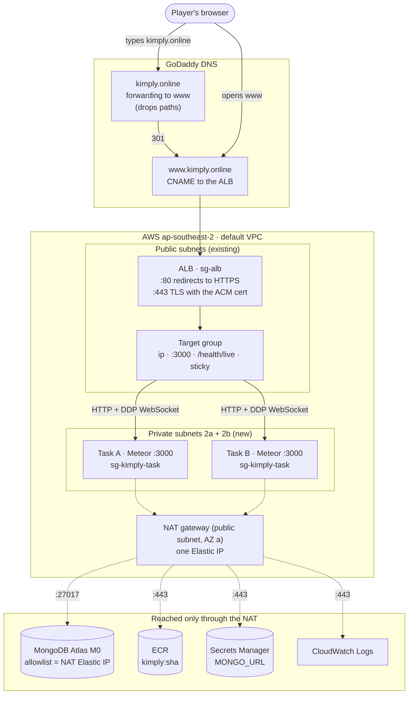
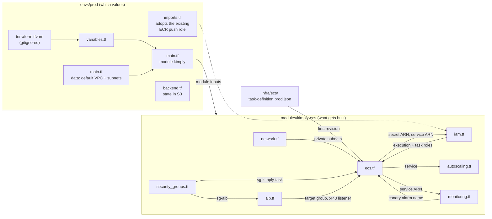
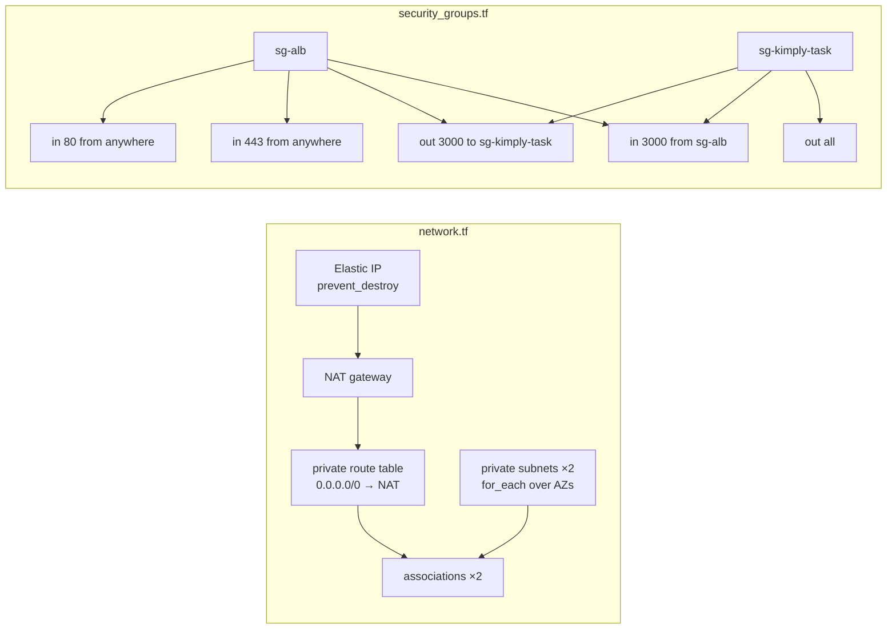
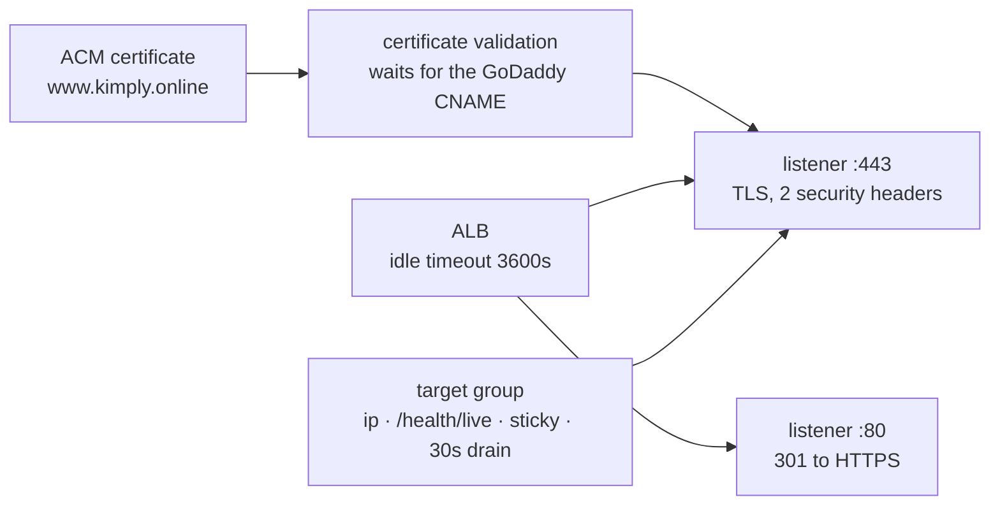
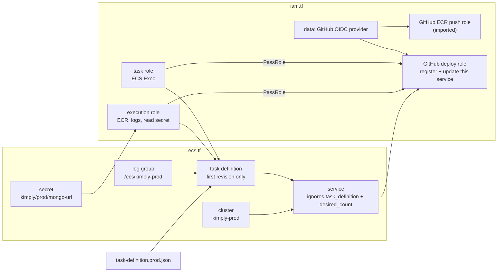
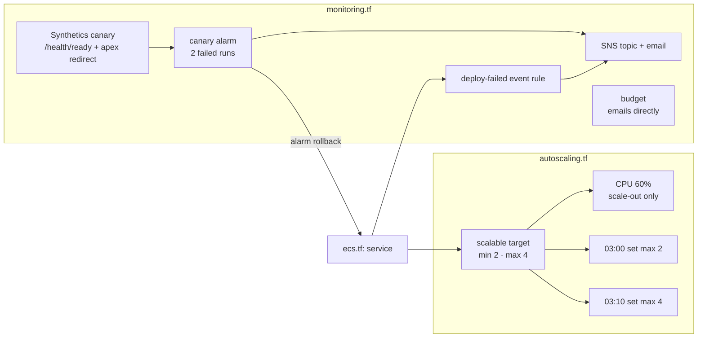
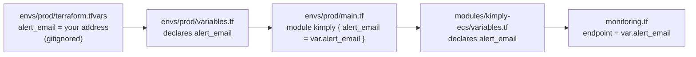
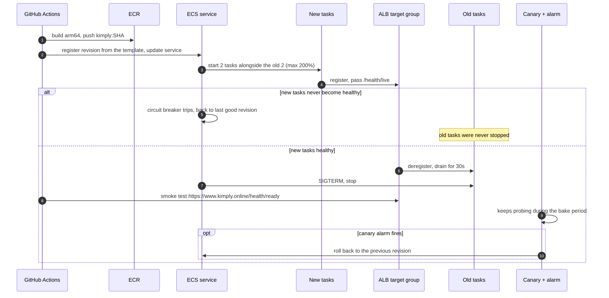

# Kimply on ECS: diagrams

Visual reference for the ECS Fargate stack in `infra/`.
The reasoning behind every piece (the D-numbers below) is in [docs/ecs-target-architecture.md](../../docs/ecs-target-architecture.md), and how to build it is in [infra/terraform/README.md](../terraform/README.md).

GitHub renders these diagrams directly.
In VS Code, a Mermaid preview extension does the same.

## 1. Runtime: how a request and a database call travel

This is the end state after cutover.
Until then the same stack serves `ecs.kimply.online` (a GoDaddy CNAME to the ALB), and `kimply.online` and `www` still point at the EC2 instance (D39).

Solid arrows are traffic players cause.
Dotted arrows are traffic the tasks start themselves.
Both directions cross the VPC's internet gateway, which is left out to keep the picture readable.

## 2. Terraform: which file builds what

An arrow `A --> B` means **B references something in A**, so Terraform creates A first.
References are the only thing that sets the order; there is no step list anywhere.

### 2a. The files and what they hand each other

### 2b. `network.tf` and `security_groups.tf`

### 2c. `alb.tf`

### 2d. `ecs.tf` and `iam.tf`

### 2e. `monitoring.tf` and `autoscaling.tf`

## 3. How one value reaches a resource

Using `alert_email`, which crosses both layers of variables.
Most values are simpler: they are written directly in `envs/prod/main.tf`, or they fall back to the module's default.

| Prefix | Value comes from |
|---|---|
| `var.x` | An input: `terraform.tfvars`, else the `default`, else Terraform asks |
| `data.TYPE.NAME.attr` | Looked up from AWS on every plan |
| `TYPE.NAME.attr` | A resource Terraform creates, known after apply and kept in state |
| `local.x` | Computed in the code |
| `module.NAME.x` | An output of a module |

## 4. A deploy, end to end

What happens on a push to `main` once the pipeline is switched to ECS.
Terraform is not involved.

